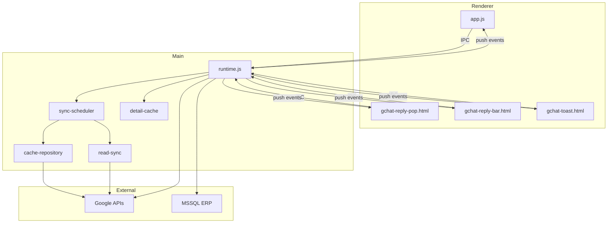

# Dependency Map

> **[差量]** Little Reply：[`15-little-reply-doc-delta.md`](./15-little-reply-doc-delta.md)。

## 分層依賴（理想 vs 現實）

```text
                    [現實：runtime.js monolith]
                              │
        ┌─────────────────────┼─────────────────────┐
        │                     │                     │
   Authorization          GChat Core            Other Features
        │                     │                     │
        └──────────┬──────────┘                     │
                   │                                │
              googleapis                         mssql
                   │                                │
              Google Cloud                      ERP DB
```

---

## Feature 依賴鏈

### Little Reply 完整鏈

```text
Little Reply UI (app.js SEG-R-011)
      ↓ window.api
IPC gchat-* (SEG-M-025)
      ↓
runtime GChat Core (SEG-M-021~024)
      ↓
├── modules/gchat/sync-scheduler
├── modules/gchat/cache-repository → searchUnreadChatMessages
├── modules/gchat/read-sync → markChatMessageReadRemote
├── modules/gchat/detail-cache
      ↓
Google Chat API

Reply Pop (gchat-reply-pop.html)
      ↓ gchatDetail / gchatReply
      ↓ 同上 + livePollTimer (額外 poll)

Toast (SEG-M-007)
      ↓ gchatCache.messages
      ↓ notifyNewGchatAlerts
```

### Gmail 鏈

```text
app.js SEG-R-010
  → get-gmail IPC
  → packetSnapshot(cache)
  → runSync 60s → Gmail API
  → gmail-packet push
```

### Sites Visits 鏈

```text
app.js SEG-R-009
  → sites-visits-report IPC
  → syncSitesVisitsIntoApp
  → enrich.js (MSSQL ERP)
  → Google Sheets log
```

---

## 跨功能依賴

| 依賴者 | 被依賴 | 類型 |
|---|---|---|
| 所有 Google features | Authorization (SEG-M-013) | 硬依賴 |
| GChat Toast/Bar/Pop | gchatCache.messages | 資料依賴 |
| GChat scheduler onAfterSync | replyPopRegistry | 跨 UI 耦合 |
| Meeting reminder | Calendar auth + cache | feature 耦合 |
| Bug report | Sheets auth + myEmail | feature 耦合 |
| AI Report | gemini config + MSSQL + knowledge | 多源耦合 |
| 所有子視窗 | broadcastAppTheme/FontScale | UI 耦合 |
| Mosaic widgets | Authorization + feature flags | 閘道耦合 |

---

## 模組化進度依賴

```text
ensureGchatSyncStack()
  ├── createReadSync(deps from runtime)
  ├── createCacheRepository(deps: searchUnreadChatMessages, ...)
  ├── createSyncService(deps: readSync, cacheRepository)
  └── createSyncScheduler(deps: syncService, onAfterSync)

→ 模組仍 **依賴 runtime 注入** 大量 closure deps，非獨立可測
```

---

## 循環依賴分析

### 潜在循環 1：GChat Sync ↔ Reply Pop ↔ Viewing

```text
scheduler onAfterSync
  → syncRegistryReplyPopBadges() [讀 registry]
  → pingViewingGchatThread() [讀 gchatViewing]
  → notifyNewGchatAlerts() [可能開 pop]

gchat-set-viewing (from Reply Pop)
  → startViewingRefreshWatch
  → pingViewingGchatThread [又打 API]

Reply Pop livePollTimer
  → gchatThreadRefresh IPC
  → loadConversationHistory [寫 packets]
  → emitGchatCacheChanged
  → app.js reload [可能觸發 setViewing]
```

**判定**：非严格 A→B→A 循环，但 **feedback loop** 存在 — 多路 poll 互相触发 cache-changed。

### 潜在循環 2：Session ↔ Feature Sync ↔ GChat Bootstrap

```text
ensureGoogleSession
  → syncAuthorizedFeatures
  → prefetchGchatTodayCache
  → startGchatSyncScheduler

gchat-alert-watch / gchat-status
  → startGchatSyncScheduler (冪等)
```

**判定**：冪等设计，无有害循环。

### 无 detectable 硬循环 require

Node require 图：
```text
runtime.js → modules/gchat/* (无反向 require)
runtime.js → sites-visits/enrich.js
```

---

## 高耦合点

| 位置 | 耦合描述 | 严重度 |
|---|---|---|
| `ensureGchatSyncStack` | 注入 10+ runtime closure | 高 |
| `emitGchatCacheChanged` | 同时 send cache-changed + list-updated + 遍历 pop | 高 |
| `syncRegistryReplyPopBadges` | 直接读 replyPopRegistry + 打 API + 改 entry badge | 高 |
| `loadConversationHistory` | API + cache + media + disk save 一体 | 高 |
| `syncAuthorizedFeatures` | 启动多个 feature bootstrap | 中 |
| Theme broadcast | 硬编码遍历所有子窗口类型 | 中 |
| app.js monolith | 7 features 共享全局变量 | 高 |

---

## 跨边界违规（架构规则视角）

| 违规 | 说明 |
|---|---|
| Renderer 60s poll Sheets/Sites | 应可改 push 或 Main 统一 poll |
| Reply Pop inline 3000 行 | UI + IPC + poll 未分离 |
| Authorization 未集中至 authorization/ 目录 | 逻辑散落 runtime 但函数集中 |
| packets 多处 direct write | 无 Repository 边界 |

---

## 依赖关系图（Mermaid）


